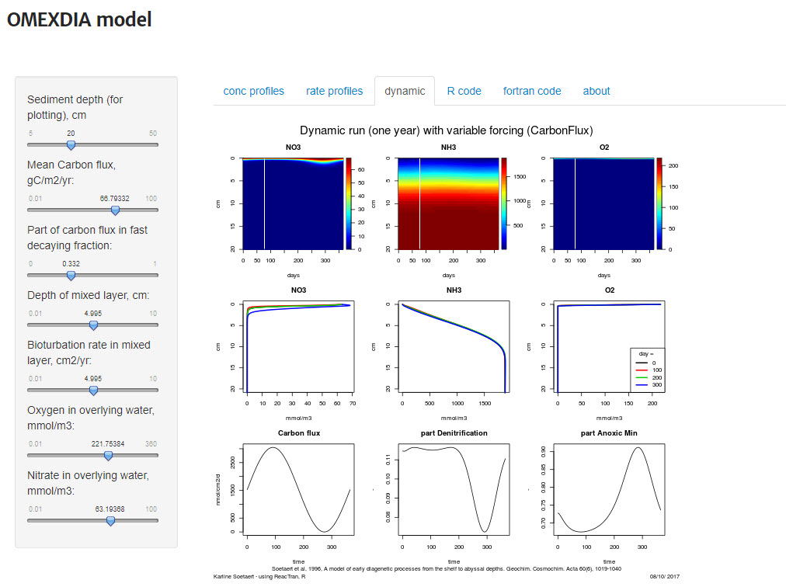

```{r setup, include=F, error=T, message=F, warning=F}
knitr::opts_chunk$set(echo=T, comment=NA, error=T, warning=F, message = F, fig.align = 'center')
```

OMEXDIA_C: C, N, and O2 **diagenesis**   
The model function, parameters, grids, budget functions   
Implementation by karline soetaert (karline.soetaert@nioz.nl)   

[Link to main page](http://www.rforscience.com/modelling/omexdia/)


## Concentration profiles

```{r, out.width = "800px", echo=F}

```


## Rate profiles


```{r, out.width = "800px", echo=F}

```


## Dynamic model

```{r, out.width = "800px", echo=F}

```

## R code

Here you can download R-code that solves the OMEXDIA model

Note that this is not the code that was used for this application, as it takes about a second to solve for the steady-state for a problem using R-code. Although this is very fast for a problem of this size, this is too slow for an interactive web application.

The web interface uses the fortran version instead.


The R code can be downloaded here:


[Download R code](http://yesr.nioz.nl:3838/omexdia/OMEXDIA_model.R)


## Fortran code

Here you find details about the Fortran code that was used to generate the model solutions, and the R-code that calls the model

The interface is rather complex, but the gain is a much faster application, so that you are able to solve a model of this complexity in real time

You can find out how to create such model applications in compiled code, using a vignette in the R-package deSolve "Soetaert, Petzoldt and Woodrow Setzer. R-package deSolve, Writing Code in Compiled Languages".


To run the Fortran code, you will need to compile it first:

You do this as follows: `system("R CMD SHLIB omexdia.f")`

Next you need to load the shared object: 1dyn.load(paste("omexdia", .Platform$dynlib.ext, sep = ""))`

To actually run the model, you need to define the parameter values, the bioturbation grid, the porosity grid and pass this all to the Fortran DLL. This is very tricky, as a mismatch between the model call and the Fortran application will cause R to crash!


[Download fortran code](http://yesr.nioz.nl:3838/omexdia/omexdia.f)   
[Download R code to call the model](http://yesr.nioz.nl:3838/omexdia/OMEXDIA_dll.R)


## About

### The OMEXDIA model

The omexdia model is an early diagenetic model describing the cycle of O, N, C in marine sediments.

It comprises 6 species (state variables): fast and slowly degrading organic matter, oxygen, nitrate, ammonium and the lump sum of other reduced substances

Cite this model as "Soetaert et al., 1996. A model of early diagenetic processes from the shelf to abyssal depths. Geochim. Cosmochim. Acta 60(6), 1019-1040".

### Implementation

For the current application, the omexdia model has been implemented in R, using the R-package ReacTran.

To make it fast enough for interactive application, the model is coded in Fortran and linked to the ReacTran package as a shared object (DLL).

Implementation by karline soetaert (karline.soetaert@nioz.nl).

### Technical details

The problem consists of 600 nonlinear equations in 600 unknowns

The steady-state solution is obtained using function steady.1D from the R-package rootSolve

The model is run dynamically using function ode.1D from the R-package deSolve

### R-Packages used

R-package ReacTran: Karline Soetaert and Filip Meysman, 2012. Reactive transport in aquatic ecosystems: rapid model prototyping in the open source software R Environmental modelling and software 32, 49-60.

R-package rootSolve: Karline Soetaert (2009). rootSolve: Nonlinear root finding, equilibrium and steady-state analysis of ordinary differential equations. R-package version 1.6

R-package deSolve: Karline Soetaert, Thomas Petzoldt, R. Woodrow Setzer (2010). Solving Differential Equations in R: Package deSolve Journal of Statistical Software, 33(9), 1--25. URL http://www.jstatsoft.org/v33/i09/.

useR differential equations in R

```{r, out.width = "150px", echo=F}

```
